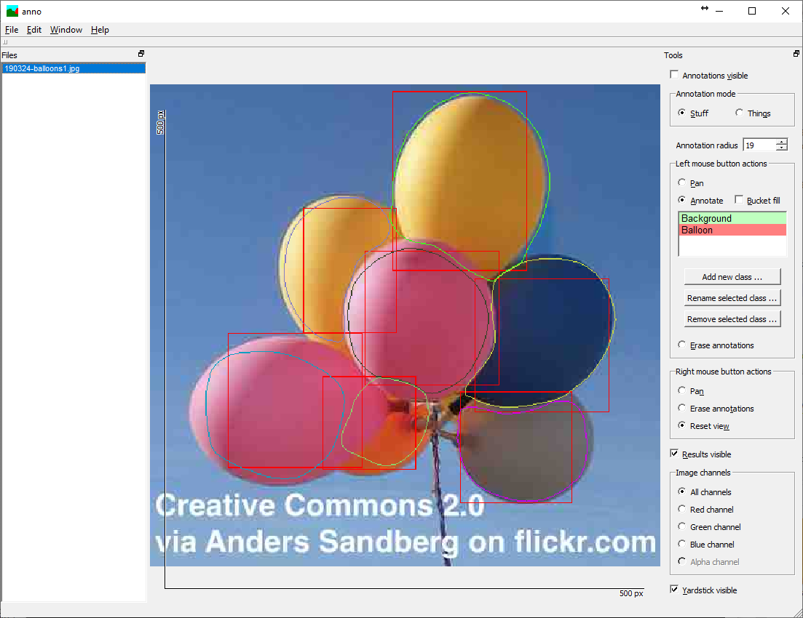

# annonet for instance segmentation
Train and apply instance-segmentation neural networks based on annotations generated using Anno

## How to
1. Use the [Anno program](https://github.com/reunanen/anno) to annotate images as follows:
   - First annotate a number of objects in the "things" mode (depending on your problem, just a few ought to be enough to at least get started):\
        
   - Then annotate individual instances in the "stuff" mode
      - Note that you _don't_ need to annotate for instance segmentation all the objects you annotated in the "things" mode (or even close to all)
      - However, the center of each "things" mode rectangle should always be annotated as part of the instance in the "stuff" mode
        (note that this might cause issues if your objects are strongly non-convex, e.g. horseshoe-shaped)
        (this is a limitation of the current version, however it is possible to improve the training code in this regard)
      - Even annotate at least some background where no instance exists (recommendation: do this mainly close to annotated things)\
        
2. Train an annonet as normal:\
   `annonet_train_cuda <path-to-images> <other-command-line-switches>`
3. Run inference as usual:\
   `annonet_infer_cuda <path-to-images>`
4. Use [this program](https://github.com/reunanen/convert-result-images-to-anno-paths) to convert the produced result mask image files to
   json paths that Anno can readily display:\
   `convert-result-images-to-anno-paths <path-to-images>`
5. Look at the inference results in Anno:\
   
   
## Another example
Here's another example. To have a look at the source data, you can open the folder `<repo-root>/example-images/balloons/anno` directly in Anno.
1. Annotated things:\
   
2. Annotations for instance segmentation:\
   \
   Do note how the center of one balloon is occluded. Therefore the area around this center is not annotated, because doing so would
   mislead the training process (at least when using the current version).
3. Inference results:\
   
